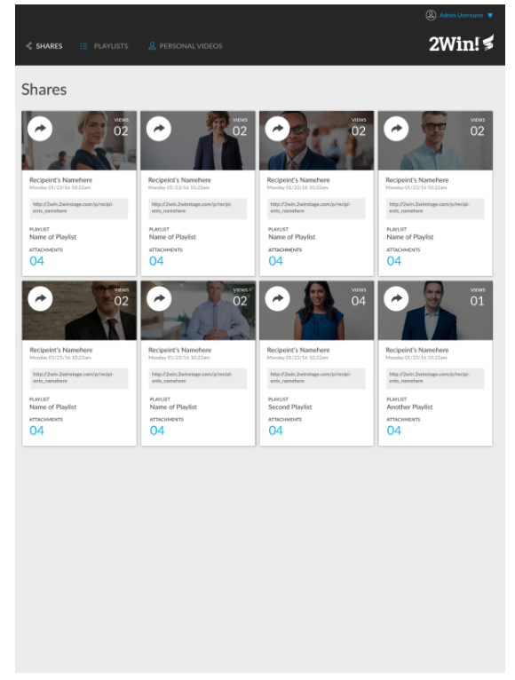

# Static-Comp-Challenge

### Deploy Link:

## Overview:

- This project was intended for students to design a static page based off of a comp. Students were given creative freedom when it came to content & color, but the layout of the cards and over all page needed to match.
- The page must also be responsive.
- The developer must utilize either a normalize or reset file for CSS.

- I wanted this page to be built essentially as a template for a future dev to come in and plug and play with colors, images, icons, etc, while still keeping the exact same layout provided by the comp, and needing very little, if any styling of element positions.

## Project Development Time Line:

### The Comp: 

## Technology Used:

- HTML
- CSS
- Chrome and FireFox developer tools
- Git
- GitHub
- Photoshop

## Future Iterations:

## Contributors:

Matt Roden

