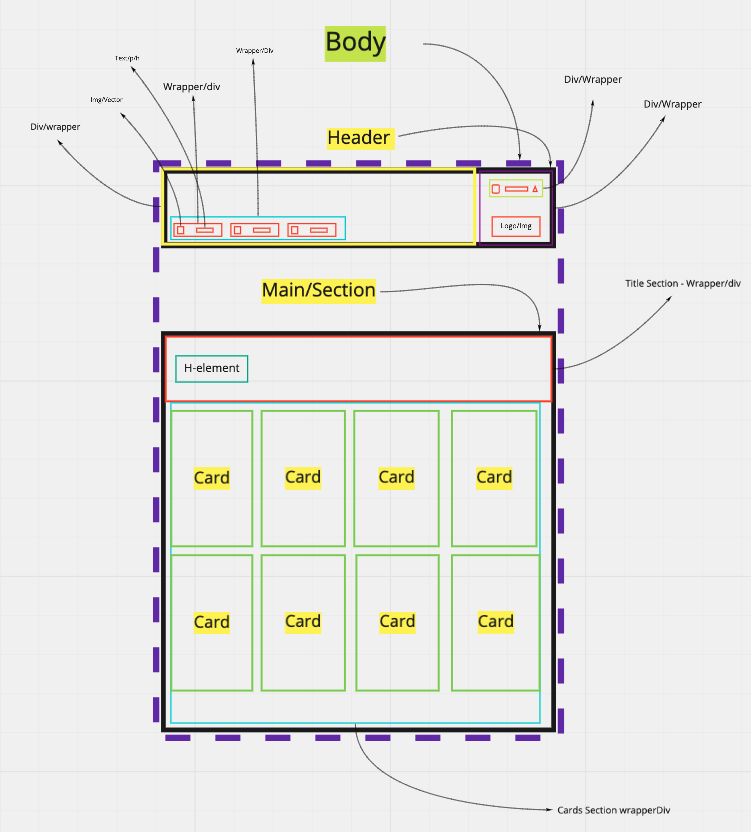
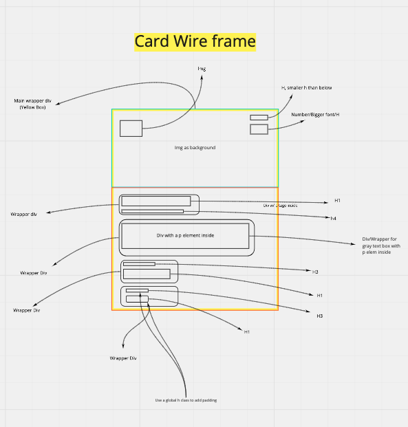

# Static-Comp-Challenge

### Deploy Link:

https://matt-roden.github.io/Static-Comp-Challenge/

## Overview:

- This project was intended for students to design a static page based off of a comp. Students were given creative freedom when it came to content & color, but the layout of the cards and over all page needed to match.
- The page must also be responsive.
- The developer must utilize either a normalize or reset file for CSS.

- I wanted this page to be built essentially as a template for a future dev to come in and plug and play with colors, images, icons, etc, while still keeping the exact same layout provided by the comp, and needing very little, if any styling of element positions.

- My page has been styled in the way of a record company's 'Artists' page.

## Project Development Time Line:

### The Comp: 

### Wireframe Stage:

### Desktop View:

### Responsive Views:

## Technology Used:

- HTML
- CSS
- Chrome and FireFox developer tools
- Miro
- Photoshop
- Git
- GitHub

## Future Iterations:

- Adding audio players to each card.
- Make the same page, but using grid.
- Instead of a vertical scroll on smaller screens, I would like to try a horizontal scroll. 

## Contributors:

Matt Roden

